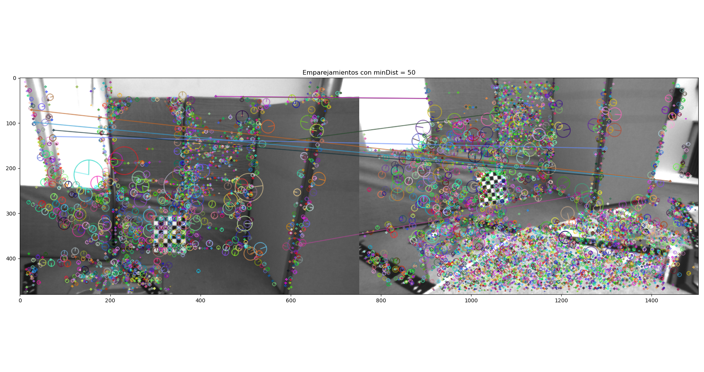
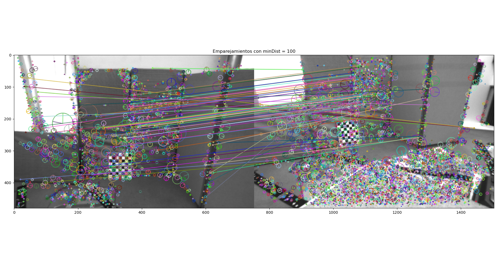
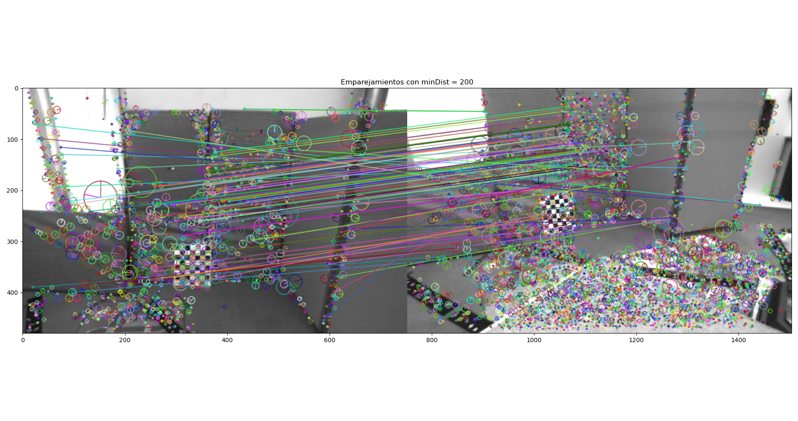
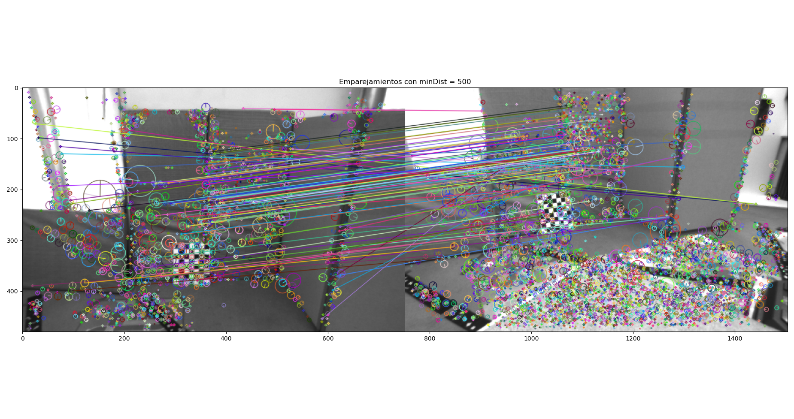
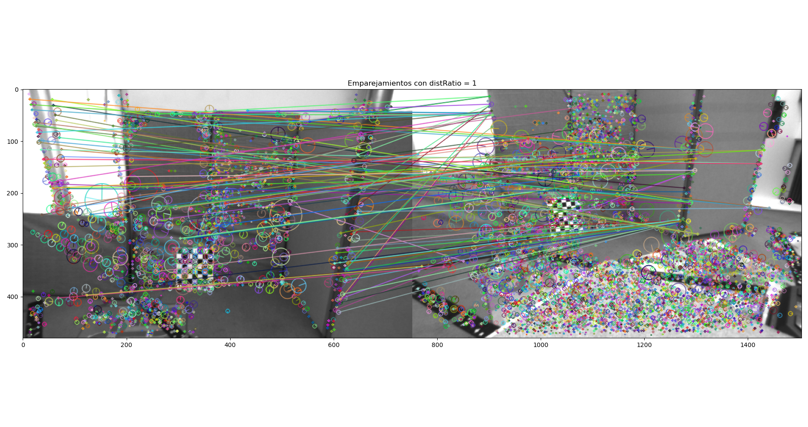
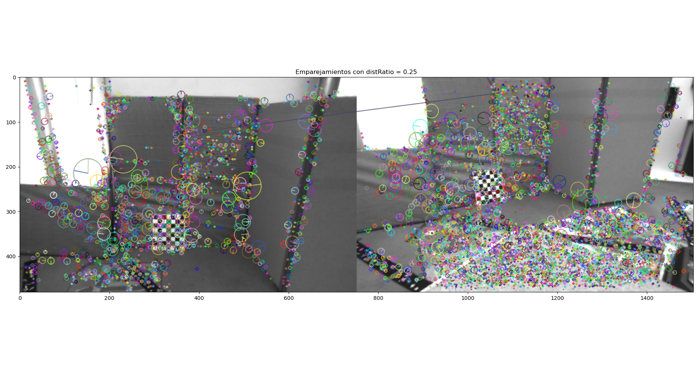
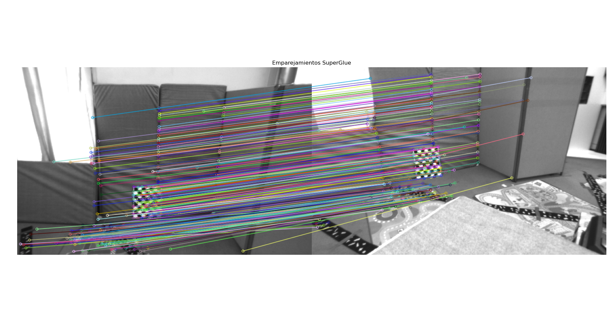

# Lab 3: Robust Homography and Fundamental Matrix Estimation

## 1. Feature matching using Nearest Neighbor distance between descriptors

Keypoints and descriptors are extracted from two images using the **SIFT (Scale-Invariant Feature Transform)** algorithm. 

### Nearest Neighbor Matching
For each descriptor in the first image, the two nearest descriptors in the second image are identified using the Euclidean distance. A match is accepted only if it meets the following conditions:
- **Distance Ratio**: The distance to the nearest neighbor must be less than a fraction (defined by `distRatio`) of the distance to the second nearest neighbor. This helps filter out ambiguous matches.
- **Minimum Distance**: The nearest neighbor’s distance must be below a certain threshold (`minDist`), ensuring only close matches are considered.

### Threshold Variation
To understand how different distance thresholds affect the matching process, we experiment with various values for `minDist`.
We experimented with the following threshold values:
```py
for minDist in [50, 100, 200, 500, 1000]:
```

### Visual Comparison of Matches for Different `minDist` Values

<div style="display: flex; justify-content: space-around;">
    <figure>
        
        <figcaption>minDist = 50</figcaption>
    </figure>
    <figure>
        
        <figcaption>minDist = 100</figcaption>
    </figure>
</div>

<div style="display: flex; justify-content: space-around;">
    <figure>
        
        <figcaption>minDist = 200</figcaption>
    </figure>
    <figure>
        
        <figcaption>minDist = 500</figcaption>
    </figure>
</div>

### Identifying Matching Errors

1. **False Positive Matches**: Occur when keypoints from different, unrelated regions of the images are matched incorrectly. These are especially prevalent in regions with repetitive patterns, such as the chessboard, where similar-looking keypoints may lead to incorrect matches.
   
2. **False Negative Matches**: Occur when correct keypoint matches are missed. This can happen if the threshold for matching is too strict, filtering out valid matches that have slightly larger descriptor distances.

### Chessboard and Image Aliasing
The chessboard pattern, due to its repetitive black-and-white squares, introduces **aliasing**. This makes it difficult for the algorithm to distinguish between similar keypoints in different squares. As a result, even with the nearest neighbor distance ratio (NNDR) check, false positive matches are hard to eliminate because multiple keypoints in the chessboard appear almost identical.


## 2. Features Matching using Nearest Neighbors Distance Ratio (NNDR)

For each descriptor in image1, we find the two closest descriptors in image2 using the Euclidean distance (L2 norm).

We only accept a match if:
- The distance to the nearest neighbor (d1) is smaller than distRatio times the distance to the second nearest neighbor (d2).
- The nearest neighbor's distance (d1) is below a specified maximum distance (maxDist).

This approach helps reduce false positive matches by filtering out ambiguous matches where the second nearest neighbor is too close.


<div style="display: flex; justify-content: space-around;">
    <figure>
        
        <figcaption>distRatio = 1</figcaption>
    </figure>
    <figure>
        
        <figcaption>distRatio = 0.8</figcaption>
    </figure>
</div>

<div style="display: flex; justify-content: space-around;">
    <figure>
        
        <figcaption>distRatio = 0.5</figcaption>
    </figure>
    <figure>
        
        <figcaption>distRatio = 0.25</figcaption>
    </figure>
</div>

### Observations
**distRatio = 1**: High number of matches, but many false positives, especially in repetitive areas like the chessboard.

**distRatio = 0.8**: Fewer matches, but still a noticeable amount of false positives.

**distRatio = 0.5**: Matches are more accurate, reducing false positives, but some correct matches are filtered out (false negatives).

**distRatio = 0.25**: Very few matches, greatly reduces false positives, but many correct matches are discarded.

**Lowering distRatio reduces false positives but increases false negatives, and vice versa.**

## 3. Feature matching using a learning based approach (Superglue)
<div style="display: flex; justify-content: space-around;">
    <figure>
        
        <figcaption>Superglue</figcaption>
    </figure>
</div>

## 4. RANSAC homography estimation

`ransac_homography`
1. Random point selection: In each iteration, randomly select 4 point pairs from the matches.
2. Homography computation: Calculate a homography based on the selected points.
3. Evaluate hypothesis: Transform points using the computed homography and calculate the error (Euclidean distance) compared to the actual points.
4. Count inliers: Count the points where the error is below a defined threshold (inliers).
5. Update best hypothesis: If the current homography has more inliers, save it as the best.
6. Final output: Return the homography with the highest number of inliers.

<div style="display: flex; justify-content: space-around;">
    <figure>
        
        <figcaption>Homography random sift</figcaption>
    </figure>
    <figure>
        
        <figcaption>Homography random SuperGlue</figcaption>
    </figure>
</div>

<div style="display: flex; justify-content: space-around;">
    <figure>
        
        <figcaption>Best Homography SITF</figcaption>
    </figure>
    <figure>
        
        <figcaption>Best Homography SuperGlue</figcaption>
    </figure>
</div>

<div style="display: flex; justify-content: space-around;">
    <figure>
        
        <figcaption>Tranfer Points SITF</figcaption>
    </figure>
    <figure>
        
        <figcaption>Tranfer Points SuperGlue</figcaption>
    </figure>
</div>

### Observations

**NNDR SIFT vs. SuperGlue Homography Estimation**

NNDR SIFT and SuperGlue perform reasonably well, aligning the key points of the scene.
The matches from SuperGlue show fewer overall connections, but appear more refined and consistent across the scene, suggesting better filtering of outliers.

NNDR SIFT captures more points, but the extra matches include more noisy points that don't always align as accurately with the homography.


**Point Transfer Using Homography**

In both methods, the transferred points follow the grid structure well, but SuperGlue results in more tightly aligned projections, showing higher precision, especially in the structured regions like the chessboard.


## 5. RANSAC fundamental matrix estimation

`ransac_f_matrix`
1. In each iteration, 8 random point correspondences (matches) are selected from the input matches.
2. Using these 8 points, the fundamental matrix F is calculated (using an 8-point algorithm).
3. For each match, the function calculates the epipolar line in the second image by multiplying the first image’s point with F
4. It normalizes this epipolar line and calculates the distance between this line and the second image’s point (transfer error). 
5. If the transfer error is below a given threshold, the point is considered an inlier.
6. If the current iteration’s fundamental matrix has more inliers than the previous best, it updates the best matrix and inliers count.


<div style="display: flex; justify-content: space-around;">
    <figure>
        
        <figcaption>Initial Points</figcaption>
    </figure>
</div>

<div style="display: flex; justify-content: space-around;">
    <figure>
        
        <figcaption>Epipolar Lines SITF</figcaption>
    </figure>
    <figure>
        
        <figcaption>Epipolar Lines SuperGlue</figcaption>
    </figure>
</div>


NNDR SIFT shows a more dispersed set of epipolar lines, with the lines intersecting at various points. This could suggest that the estimated fundamental matrix has more noise, likely due to the higher number of less accurate correspondences.

SuperGlue, on the other hand, presents more consistent and aligned epipolar lines, indicating a better estimation of the fundamental matrix with fewer outliers. The lines are less spread, suggesting a more accurate match set and thus better geometric consistency.


## 6. Guided matching using epipolar geometry

1. Para cada punto en la primera imagen usar la matriz fundamental para proyectar su línea epipolar en la segunda imagen: `l = F * punto[i]`
2. Para cada punto candidato en la segunda imagen, calcular su distancia a la línea epipolar
3. Si la distancia es menor que un umbral, considerar punto como posible coincidencia


<div style="display: flex; justify-content: space-around;">
    <figure>
        
        <figcaption>Initial Points SITF</figcaption>
    </figure>
    <figure>
        
        <figcaption>Guided matching SITF</figcaption>
    </figure>
</div>

<div style="display: flex; justify-content: space-around;">
    <figure>
        
        <figcaption>Initial Points SuperGlue</figcaption>
    </figure>
    <figure>
        
        <figcaption>Guided matching SuperGlue</figcaption>
    </figure>
</div>


### Observations

In the images, we observe the results of feature matching using two approaches: **NNDR SIFT** and **SuperGlue**. 

- **Blue markers** represent the original matching points between the two images.
- **Yellow markers** indicate the initial matches detected by either **NNDR SIFT** or **SuperGlue**.
- **Red markers** highlight new matches identified after applying the epipolar constraint, which helps refine the matches based on the fundamental matrix.

- The **epipolar constraint** successfully identifies more inlier matches, reducing false positives.
- **SuperGlue** produces more accurate initial matches, while **NNDR SIFT** identifies a higher number of matches, but with a greater need for refinement.