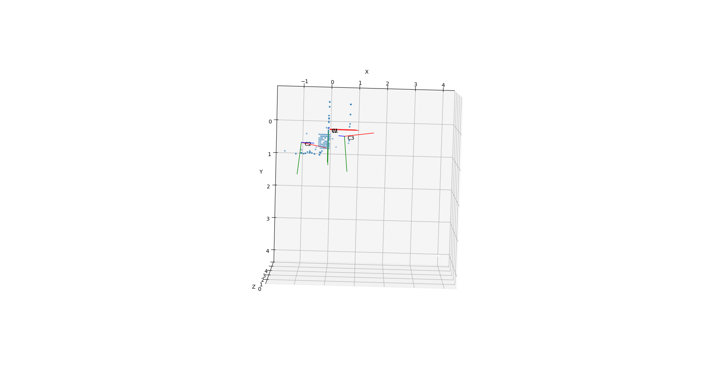
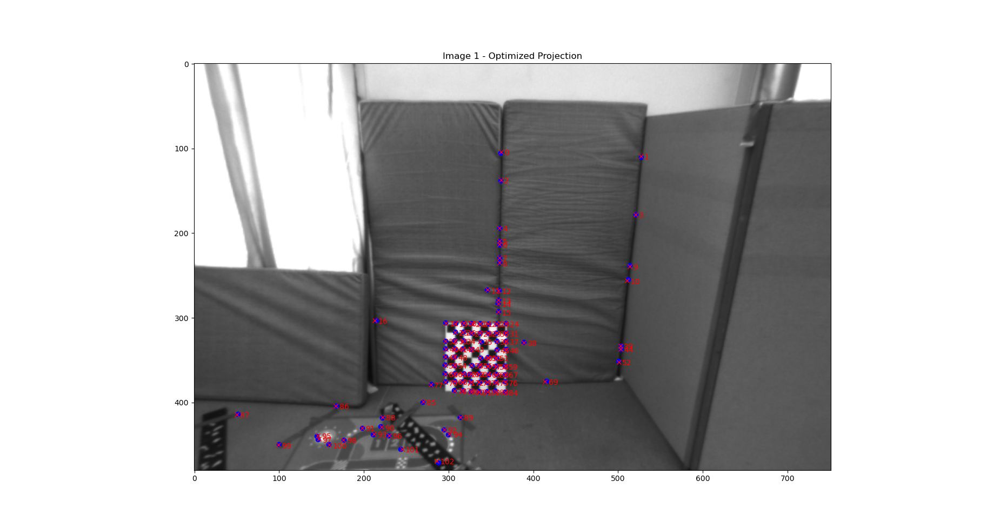
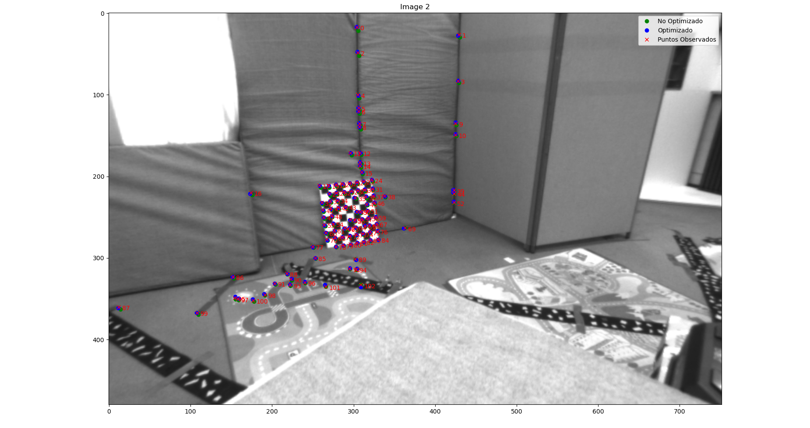
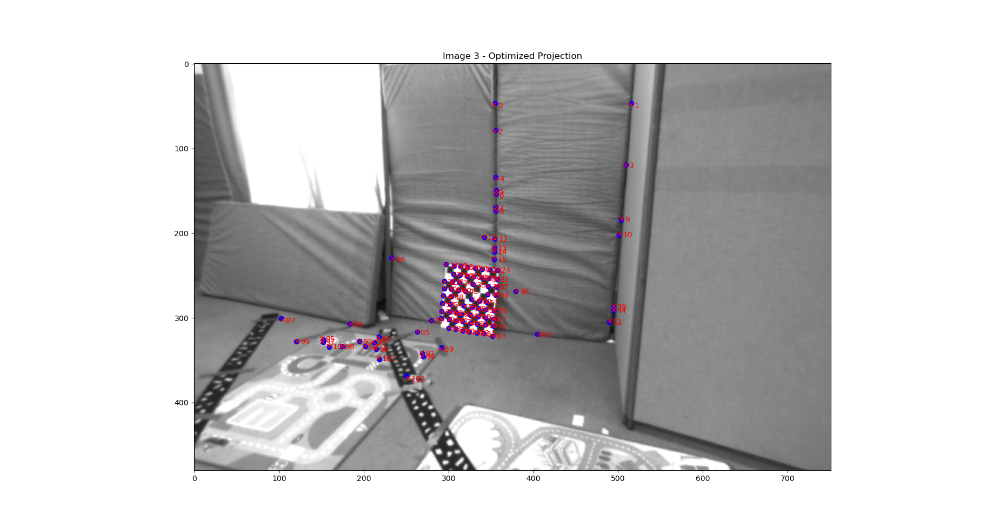

# Lab 4: Bundle Adjustment and Multiview Geometry


## 2. Pose estimation and bundle adjustment

Para un punto en la primera imagen, su punto correspondiente en la segunda imagen debe estar en una línea particular llamada línea epipolar. 

**Matriz fundamental F:** Define la relación entre los puntos corrrespondientes

x_2.T * F * X_1 = 0

**Matriz esencial E:** A partir de las matrices intrínsecas, podemos derivar la matriz esencial.

E = K_2.T * F * K_1

**Descomposición de E para obtener la Pose**: 

E = [t] R

### 2.1 Bundle Asjustment

Técnica de optimización usada para refinar simultáneamente 
- Las poses de las cámaras (es decir, su posición y orientación en el espacio 3D).
- Las coordenadas de puntos 3D que fueron observados en múltiples imágenes.

El objetivo es minimizar el error de proyección entre: 

- La posición observada de los puntos 2D en las imágenes (datos reales).
- La posición proyectada de esos mismos puntos, calculada a partir de su posición 3D y la pose de la cámara.

#### Implementaciones

Difieren en la manera en que representan y optimizan las rotaciones de las cámaras, lo cual tiene implicaciones importantes en términos de estabilidad numérica y eficiencia. 

```python
def run_bundle_adjustmentFull(T, K, X_w, imgPoints):
```
En esta implementación, cada matriz de transformación de cada cámara (excepto la primera, que se toma como referencia y se mantiene fija) se representa y optimiza directamente como una matriz T_xc (3x4). Es decir, cada matriz T_wc se representa por 12 paŕametros aplanados (9) de rotación y 3 de traslación

Desventajas:
- La rotación 3x3 tiene 9 valores, pero solo 3 grados de libertad. Optimizar los 9 elementos de R es redundante


<div style="display: flex; justify-content: space-around;">
    <figure>
        
        <figcaption>Image 1</figcaption>
    </figure>
    <figure>
        
        <figcaption>Image 2</figcaption>
    </figure>
</div>


## 3. Perspective-N-Point pose estimation of camera three

Perspective-n-Point o PnP
- Un conjunto de puntos 3D en el sistema mundial ( objectPoints)
- Sus correspondientes puntos proyectados 2D en la imagen de la cámara (imagePoints)


solvePnP estima el rvec (vector de rotación) y tvec (vector de traslación) que posicionan y orientan la cámara en el espacio 3D.

Una vez obtenidos rvec (vector de rotación) y tvec
(vector de traslación )

`T_wc3 =T_wc1⋅T_c1_c3`
​
<div style="display: flex; justify-content: space-around;">
    <figure>
        
        <figcaption>Camara 3 respecto a 1</figcaption>
    </figure>
    <figure>
        
        <figcaption>Camara 3 respecto a 1 correcta</figcaption>
    </figure>
</div>

## 4. Bundle adjustment from 3 views

<div style="display: flex; justify-content: space-around;">
    <figure>
        
        <figcaption>Image 1</figcaption>
    </figure>
    <figure>
        
        <figcaption>Image 2</figcaption>
    </figure>
</div>

<div style="display: flex; justify-content: space-around;">
    <figure>
        
        <figcaption>Image 3</figcaption>
    </figure>
</div>


