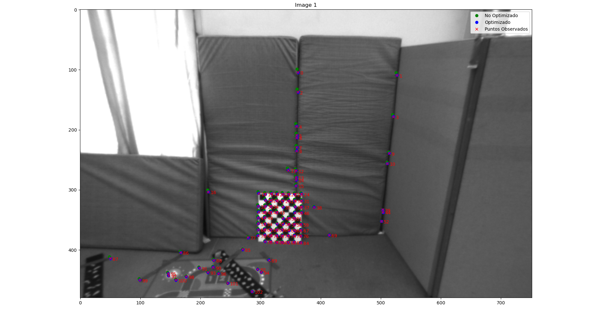
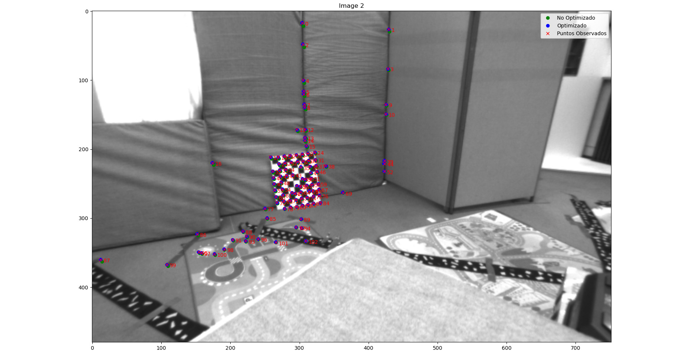
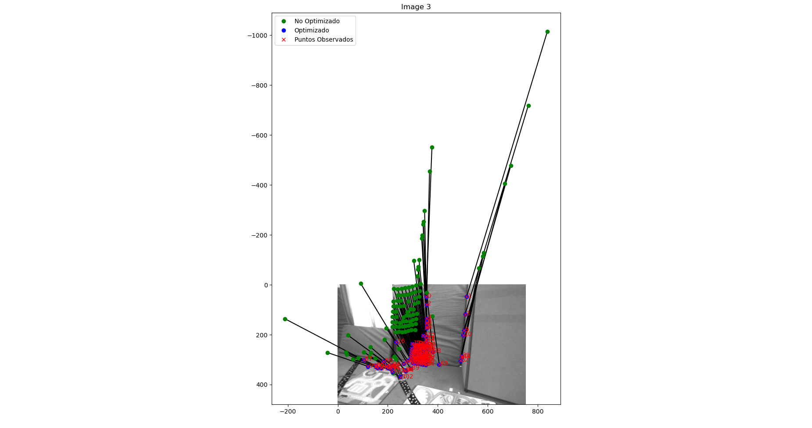
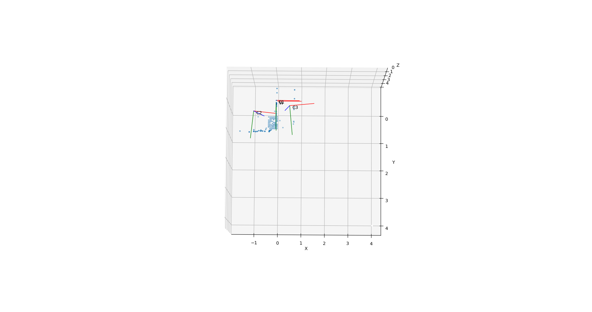

# Lab 4: Bundle Adjustment and Multiview Geometry


## 2. Pose estimation and bundle adjustment

Para un punto en la primera imagen, su punto correspondiente en la segunda imagen debe estar en una línea particular llamada línea epipolar. 

**Matriz fundamental F:** Define la relación entre los puntos corrrespondientes

x_2.T * F * X_1 = 0

**Matriz esencial E:** A partir de las matrices intrínsecas, podemos derivar la matriz esencial.

E = K_2.T * F * K_1

**Descomposición de E para obtener la Pose**: 

E = [t] R

### 2.1 Bundle Asjustment

Técnica de optimización usada para refinar simultáneamente 
- Las poses de las cámaras (es decir, su posición y orientación en el espacio 3D).
- Las coordenadas de puntos 3D que fueron observados en múltiples imágenes.

El objetivo es minimizar el error de proyección entre: 

- La posición observada de los puntos 2D en las imágenes (datos reales).
- La posición proyectada de esos mismos puntos, calculada a partir de su posición 3D y la pose de la cámara.

### 2.2 Rotación con Parámetros en so(3)
`θ = (θ1, θ2, θ3).T`: Describe la rotación en términos de una rotación alrededor del eje definido por un vector unitario u y un ángulo `||θ||`
Matriz antisimétrica `[θ]x` decribe esta rotación en el espacio tridimensional

```
            0   -θ3   θ2
[θ]x =      θ    0   -θ1
            -θ2  θ1   0
```

`R = Exp([θ]x)`, permite convertir el vector 𝜃 en una matriz de rotación 𝑅

`[θ]x = log(R)`


```python
def resBundleProjection(Op, x1Data, x2Data, K_c, nPoints):
"""
-input:
    Op: Optimization parameters: this must include aparamtrization for T_21 (reference 1 seen from reference 2) in a proper way and for X1 (3D points in ref 1)
    x1Data: (3xnPoints) 2D points on image 1 (homogeneous coordinates)
    x2Data: (3xnPoints) 2D points on image 2 (homogeneous coordinates)
    K_c: (3x3) Intrinsic calibration matrix nPoints: Number of points
-output:
    res: residuals from the error between the 2D matched points and the projected points from the 3D points (2 equations/residuals per 2D point)
"""
```
x1Data originalmente se encuntran en la referencia de la cámara 1
Para transformar estos puntos a la referencia de la cámara 2: `X2=R * x1Data + T`

1. Extraer parámetros de rotación y traslación de Op
2. Calcular la matriz de rotación R usando theta y la exponencial de matrices
3. Proyectar los puntos 3D en las imágenes 1 y 2
4. Calcular los residuales

### 2.1 Bundle adjustment from two views

**¿Qué hay que hacer?**
1. Solución Inicial de la Matriz Esencial
2. Implementar el Bundle Adjustment Usando least_squares
3. Visualizar los Resultados 3D y Compararlos con el Ground Truth (resultados sin optimizar y optimizados)

<div style="display: flex; justify-content: space-around;">
    <figure>
        
        <figcaption>Image 1</figcaption>
    </figure>
    <figure>
        
        <figcaption>Image 2</figcaption>
    </figure>
</div>

<div style="display: flex; justify-content: space-around;">
    <figure>
        
        <figcaption>Image 3</figcaption>
    </figure>
</div>

Nuestra aproximación se basa en 

## 3. Perspective-N-Point pose estimation of camera three

Perspective-n-Point o PnP
- Un conjunto de puntos 3D en el sistema mundial ( objectPoints)
- Sus correspondientes puntos proyectados 2D en la imagen de la cámara (imagePoints)


solvePnP estima el rvec (vector de rotación) y tvec (vector de traslación) que posicionan y orientan la cámara en el espacio 3D.

Una vez obtenidos rvec (vector de rotación) y tvec
(vector de traslación )

`T_wc3 =T_wc1⋅T_c1_c3`
​
<div style="display: flex; justify-content: space-around;">
    <figure>
        
        <figcaption>Camara 3 respecto a 1</figcaption>
    </figure>
</div>

## 4. Bundle adjustment from 3 views

 