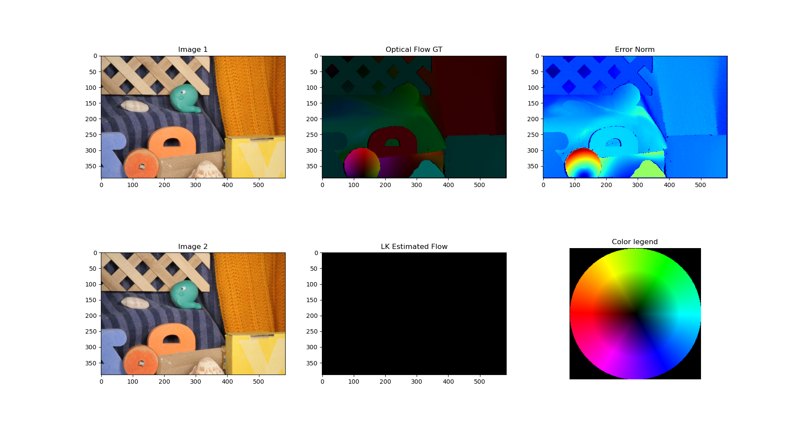
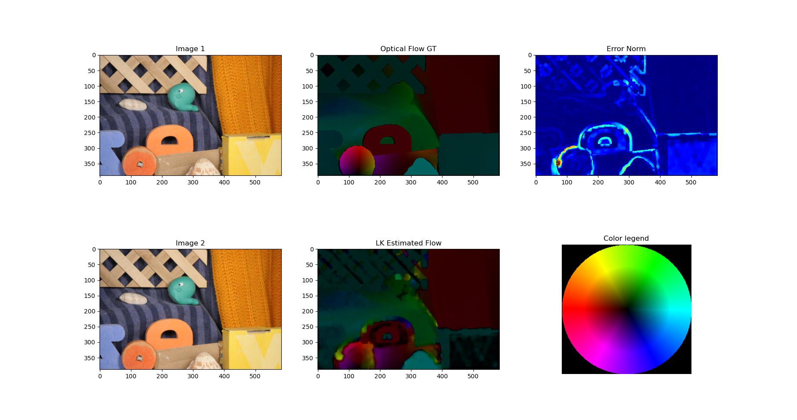
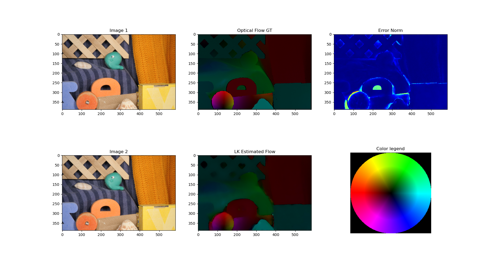

# Lab 6: Optical flow.


## 2.1 Normalized Cross Correlation
```python
def seed_estimation_NCC_single_point(img1_gray, img2_gray, i_img, j_img, patch_half_size: int = 5, searching_area_size: int = 100):
```
It is used to estimate the initial optical flow between two grayscale images at a specific point. This is based on normalized cross-correlation (NCC) to find the best match for a patch (a small window of pixels).

1. Patch extraction from the first image:
2. Definition of the search region in the second image: A larger search region  than the patch.
3. Calculation of normalized cross-correlation (NCC): The patch from the first image is compared with all possible locations within the search region in the second image using NCC.
4. Finding the best match
5. Optical flow calculation


## 2.2 Lucas Kanade Refinement
```python
def lucas_kanade_refinement(img1, img2, points, initial_flows, patch_half_size=5, epsilon=1e-2, max_iterations=100):
```
It is based on the assumption that pixel intensities between two consecutive images remain consistent in small regions of interest.

`I(x,y,t)=I(x+u, y+v, t+1)`

1. Gradients of the first image
2. Initialization of refined flows
3. Extraction of the centered patch for each point (x,y)
4. Construction of the matrix A
5. Iterative refinement to minimize the intensity error


## 2.4 Results





## 3.2 Images 

Luka kanade flow


farneback flow


tvl1 flow

