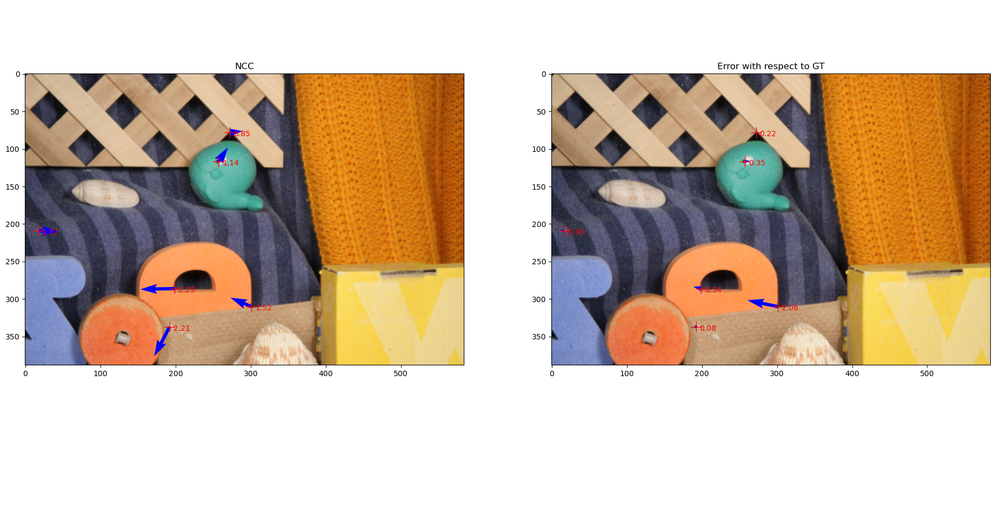

# Lab 6: Optical flow.


## 2.1 Normalized Cross Correlation
```python
def seed_estimation_NCC_single_point(img1_gray, img2_gray, i_img, j_img, patch_half_size: int = 5, searching_area_size: int = 100):
```
Se utiliza para estimar optical flor inicial entre dos imágenes en escala de grises en un punto específico. Basado en la correlación cruzada normalizada (NCC) para encontrar la mejor coincidencia de un parche (pequeña ventana de píxeles)

1. Extracción del parche de la primera imagen
2. Definición de la región de búsqueda en la segunda imagen (mayor que el parche)
3. Cálculo de la correlación cruzada normalizada (NCC). Que compara el parche de la primera imagen con todas las psoibles ubicaciones dentro de la región de bśuqueda
4. Encontrar la mejor coincidencia
5. Calculo optical flow


## 2.2 Lucas Kanade Refinement
```python
def lucas_kanade_refinement(img1, img2, points, initial_flows, patch_half_size=5, epsilon=1e-2, max_iterations=100):
```
Se basa en la suposición de que las intensidades de los píxeles entre dos imágenes consecutivas son consistentes en pequeñas regiones de interés 

`I(x,y,t)=I(x+u, y+v, t+1)`

1. Gradientes de la primera imagen
2. Inicialización de refined flows
3. Extracción del parche centrado para cada punto (x,y)
4. Construcción de la matriz A
5. Refinamiento iterativo para minimizar el error de intensidad


## 2.4 Comparations



En regiones con texturas claras, como los objetos en la parte inferior, el flujo estimado parece consistente.

En áreas con menos textura o con ambigüedad, como la superficie del objeto naranja, el flujo puede ser menos preciso.

Los errores son más significativos en:
- Bordes de objetos (e.g., entre el objeto naranja y la superficie marrón), donde los cambios abruptos de intensidad dificultan la correlación precisa.


Fortalezas: Funciona bien en áreas con texturas claras y patrones únicos.
Debilidades: Falla en zonas homogéneas, con poca textura o patrones repetitivos, y en bordes o transiciones abruptas.


En comparación con NCC, Lucas-Kanade parece producir flujos más precisos, especialmente en zonas de transición y bordes, gracias a su enfoque basado en gradientes locales.

Lucas-Kanade muestra un rendimiento notablemente mejor en regiones complejas como bordes y transiciones, donde NCC tuvo dificultades debido a su dependencia de patrones globales.
Sin embargo, ambas técnicas aún presentan limitaciones en áreas homogéneas o con texturas repetitivas.

